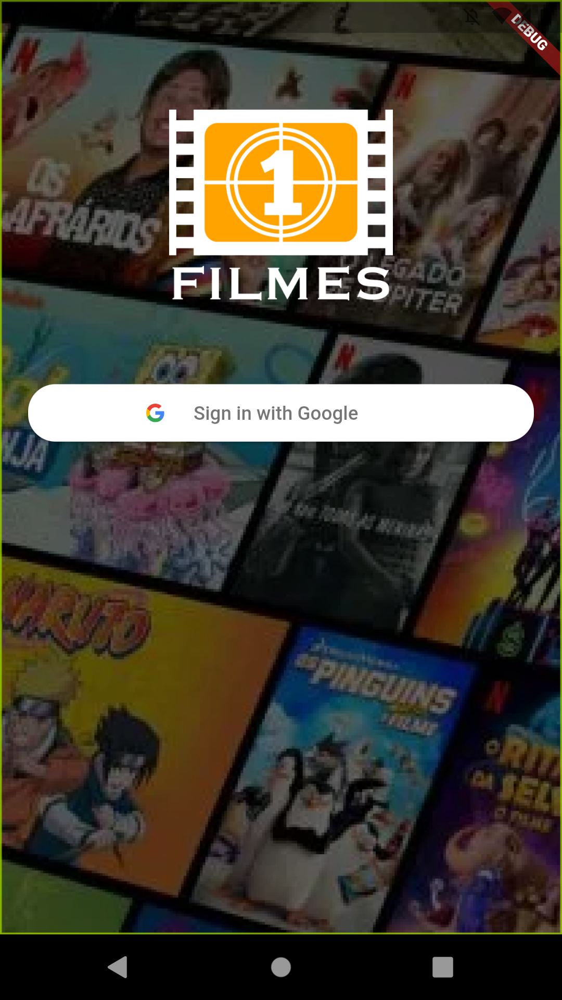
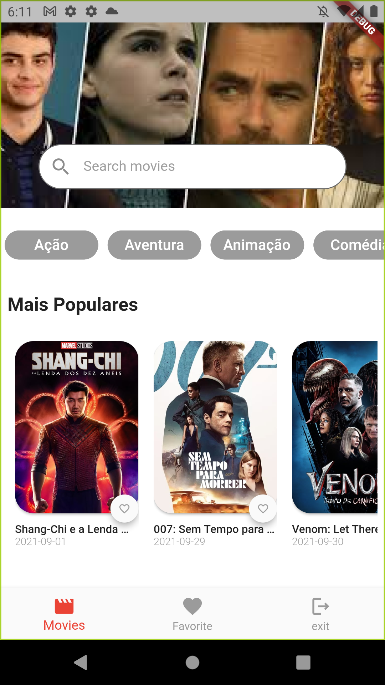
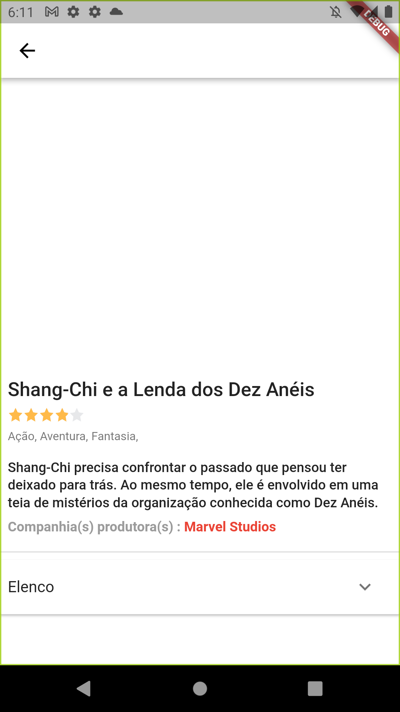

<h1 align="center">moveis_play</h1>

## Descrição do Projeto

- TheMovie App feito para estudo  é uma solução vê catalogos de filmes.

### 🛠 Tecnologias
- [Flutter](https://flutter.dev/)

### 🛠 Screenshot

### Autores
---
Feito com ❤️ por 

<a href="###">
 

 

  <b>Carlos Castro</b></a> <a href="###" title="">🚀</a>

  
  ## 📝 Licença

Este projeto esta sobe a licença [MIT](./LICENSE).
